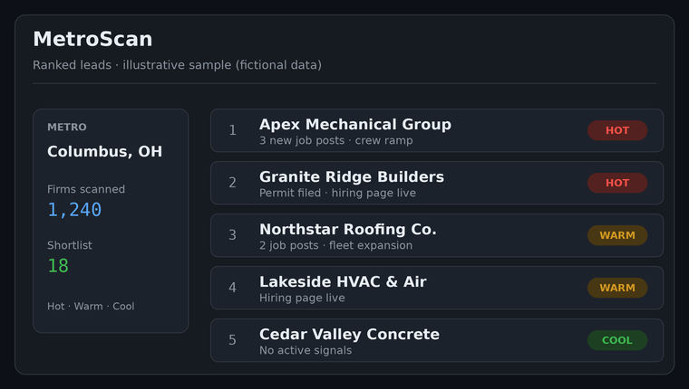
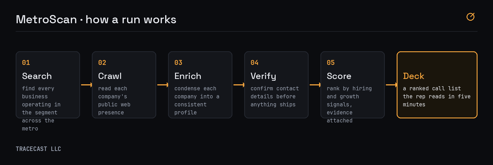

# MetroScan

MetroScan came out of watching someone close to me grind through B2B sales. A big chunk of the
day goes to just figuring out who is even worth calling. A rep gets handed a territory and a
quota, and the first hour of every morning disappears into browser tabs: maps, review sites, job
boards, a half-updated spreadsheet. I wanted to build the thing that does that part for them.

MetroScan reads public information about contractors across a metro, works out which ones look
like they are hiring or ramping up right now, and ranks them into a shortlist with the evidence
attached. The rep starts the day on the best accounts instead of guessing.

## What a run looks like

A run takes a metro and a market segment and produces a ranked lead deck. Under the hood it
moves through five stages:

1. **Search.** Enumerate the businesses that actually operate in the segment across the metro,
   drawn from public listings and directories.
2. **Crawl.** Visit each company's public web presence and pull the text that matters: what they
   do, where they work, whether they are advertising for help.
3. **Enrich.** A large-language model reads the crawled material and condenses each company into
   a consistent profile, so hundreds of messy websites become comparable records.
4. **Verify.** Confirm contact details before anything ships in a deck.
5. **Score.** Rank every firm by how likely it is to be hiring or expanding right now. Every score carries the evidence behind it, so a rep can read
   exactly why a lead sits where it does.

The specific sources and the scoring approach are private.

## What comes out

A deck: a ranked shortlist of companies, each with a profile, the buying signals found, verified
contact information, and the evidence for the ranking. Built to be read in five minutes before the first call.

## Where it has run

Decks delivered across 10+ metro markets, feeding real outreach for a working sales team.

## Tech

Python end to end. Public data sources, a large-language model for reading, summarizing, and
scoring, and automated report generation.

## Status

A real, working product. The code and the scoring are private; this repo is the overview.

Built by Tracecast LLC.
